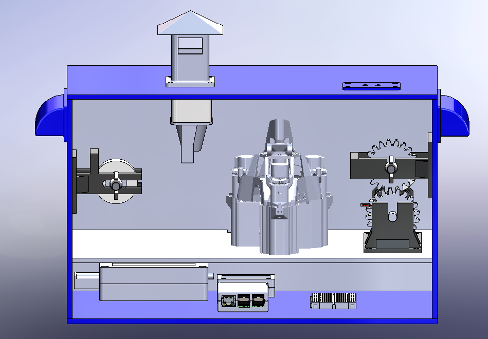

# PollenTrack-Project
PollenTrack is a pollen sensor project developed as part of the engineering projects at our school.  This repo focus on hardware. All parts are designed to be easily print or laser cut by begginers.

<h1>Final visual of the PollenTrack sensor</h1>

